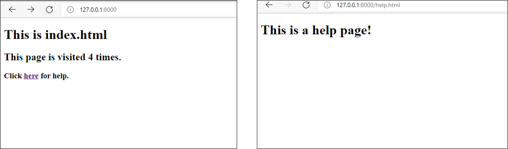

Aum Amma

# Getting started with Django

Please ensure python3 and pip are installed, if not already installed.

## Step 0: Installing Django

To install on Windows, go to https://docs.djangoproject.com/en/4.0/howto/windows/
- Open Command prompt
- Upgrade pip
  > python -m pip install --upgrade pip <br>
- Navigate to a folder where you want to create a project
  > cd D:\Swaminathan\fsd\django <br>
- Create a virtual environment
  > python -m venv myenv <br>
- Change directory to the virtual environment and examine the contents
  > cd myenv <br>
  > dir <br>
  * Include/
  * Lib/
  * pyveng.cfg
  * Scripts
- Activate the virtual environment
  > myenv\Scripts\activate <br>
- Once activated, the venv name should show up in the prompt. i.e. (myenv) 
  > Eg. (myenv) D:\Swaminathan\Learn\django> <br>
- Install Django
  > python -m pip install Django <br>
- Verify you Django installation
  > django-admin --version <br>

## Step 1: Creating a new project

- Start a new project
  > django-admin startproject first_project <br>
- Check the contents of the first_project
  * first_project
    * first_project
      * asgi.py
      * settings.py  - To store all project settings
      * urls.py  - To store all url patters for the project (basically different pages of the web app - use regexp)
      * wsgi.py - Acts as the Web Server Gateway Interface to deploy the web app to production
      * _ _init_ _.py  - Lets Python know this directory can be treated as a package
    * manage.py  - Associated with many of the things that we do with the project
- Run the project
  > cd first_project <br>
  > python manage.py runserver <br>
- Check the working of the project
  * Open the browser
  * Type the url http://127.0.0.1:8000/

## Step 2: Creating a Django Application

A Django application is a part of your web application which does a particular functionality. A django app can be reused by plugging into another django project.

* Navigate to first_project directory (top folder of the django project)
  > python manage.py startapp first_app
* The folder structure looks as follows
  * db.sqlite3
  * first_app/
    * admin.py  - To register your models here. Django will then use the models with admin interface
    * apps.py  - To specify app configurations
    * migrations/  - To store database related information 
    * models.py  - To store app's data models
    * tests.py  - Functions to test your code
    * views.py  - Functions to handle requests and return responses 
    * _ _init_ _.py  - Same purpose. This directory can be treated as a package
  * first_project/
* Open settings.py in the project folder (first_project)
* Scroll down to INSTALLED_APPS list
* Add first_app to the list
* Start the project again
* Run the project
  > python manage.py runserver <br>
* Check the working of the project
  * Open the browser
  * Type the url http://127.0.0.1:8000/ 
* Stop the server

## Step 3: HelloWorld application (HttpResponse)

* Open **views.py** in the first_app folder
* Add the following code below the existing code and save
``` python
from django.http import HttpResponse

def index(request) :    # 'request' name is convention. It can be some other name too.
    return HttpResponse("Hello World")
```
* Note: Each view must return an HttpResponse object
* Now, map this view to the urls.py file in project folder (first_project)
* Open **urls.py**
* Add the following statement above urlpatterns list
```python
from first_app import views
```
* Add the following to urlpatterns list
```python
urlpatterns = [
    path('', views.index, name='index'),
    path('admin/', admin.site.urls),
]
```

## Step 4: Using Template (render) 

Template contains the static part of the html page. Template tags allow you to inject html content dynamically. Django apps will produce this dynamic content.

* First create **templates** directory under first_project
  * first_project/templates
* Let django know of the templates by editing the DIR key inside the TEMPLATES dictionary in **settings.py** <br>
  Use Python's os module to specify the path without hardcoding.
  1. import os  - Include this in the beginning     # to be added at the top 
  2. TEMPLATE_DIR = os.path.join(BASE_DIR, "templates")  # to be added after BASE_DIR
  3. 'DIRS': [TEMPLATE_DIR]   # to be inserted inside TEMPLATES under 'DIRS' key 
* Create **index.html** inside the  first_project/templates directory
  * first_project/templates/index.html
* In **views.py**, instead of return HttpResponse(), use render function
  * return render(request, 'index.html')
* Start the server
  * python manage.py runserver
* Open the browser and navigate to https://127.0.0.1:8000
  * The page should be displayed

## Step 5: Template tags (Injecting content into html)
Let's introduce a variable **inject_var** in **index.html** and inject its value through **views.py**.
  
* In **index.html**
  
```html
<!DOCTYPE html>
<html lang="en" dir="ltr">
  <head>
    <meta charset="utf-8">
    <title>First App</title>
  </head>
  <body>
    <h1>This is index.html</h1>

    <h2>{{ inject_var }}</h2>
  </body>
</html>
```
  
* In **views.py**
```python
from django.shortcuts import render
from django.http import HttpResponse

def index(request) :
    my_dict = { 'inject_var' : "This is an injected content"}
    return render(request,'index.html',context=my_dict)
```

##  Step 6: An Exercise to Count the number of page visits
  
Now let's use the template tags to count the number of page visits
  
* In **views.py**, define a global variable 'clicked' and initialize it to 0.
* Inside the index() function, increment 'clicked'.
* Insert the 'clicked' value into the inject_var string
  
* Run the server and check out its working. Everytime you refresh the page, the clicked count will be incremented.

## Step 7: An Exercise to Add a new page

* Add a help page (help.html)
* Provide a hyperlink in index.html which when clicked will take you to help.html
* Try and do all that is necessary to implment this functionality

After implementing exercises 1 and 2, your pages should look similar to the below.<br><br>


## Step 8: Adding static files
