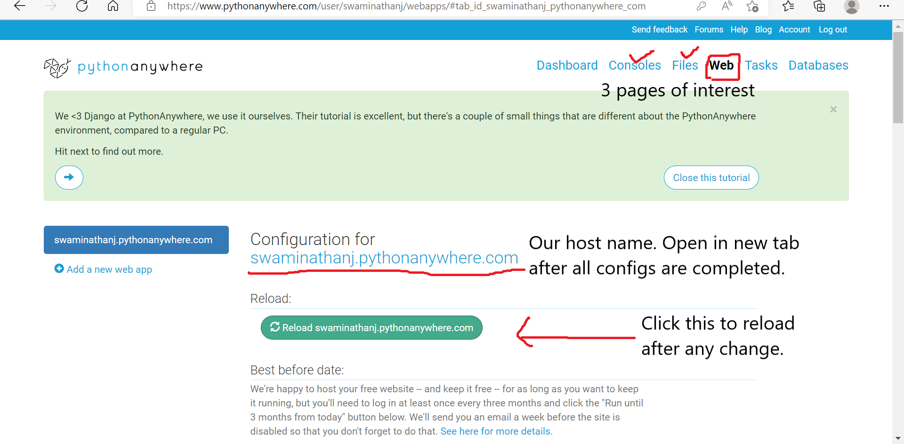
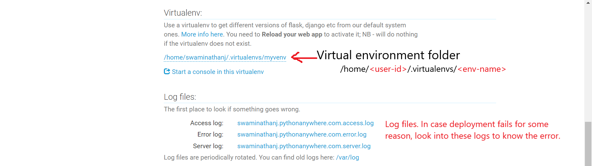
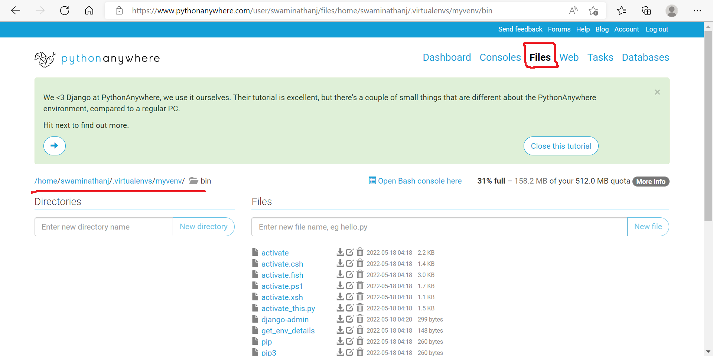
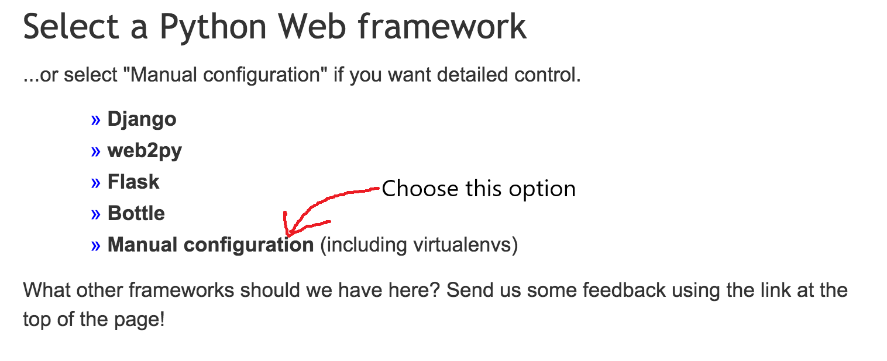
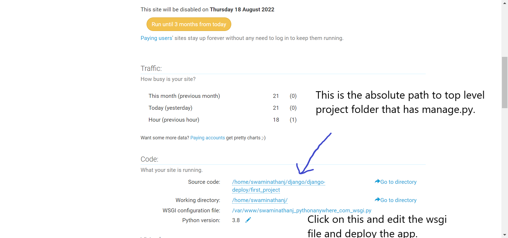
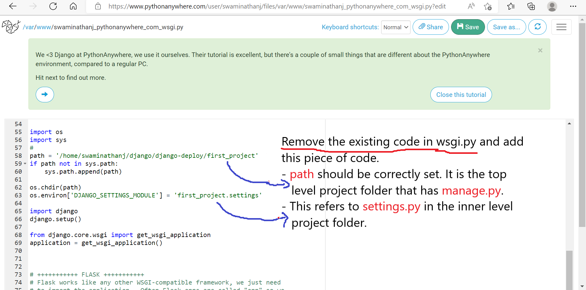
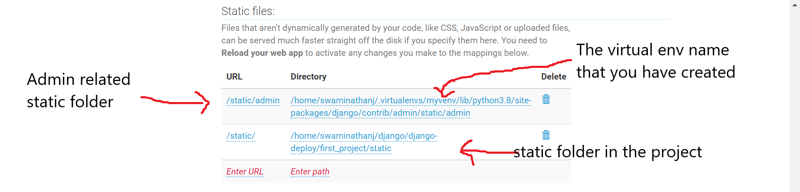
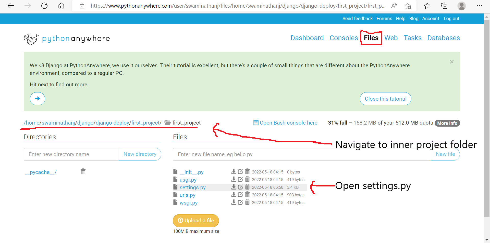
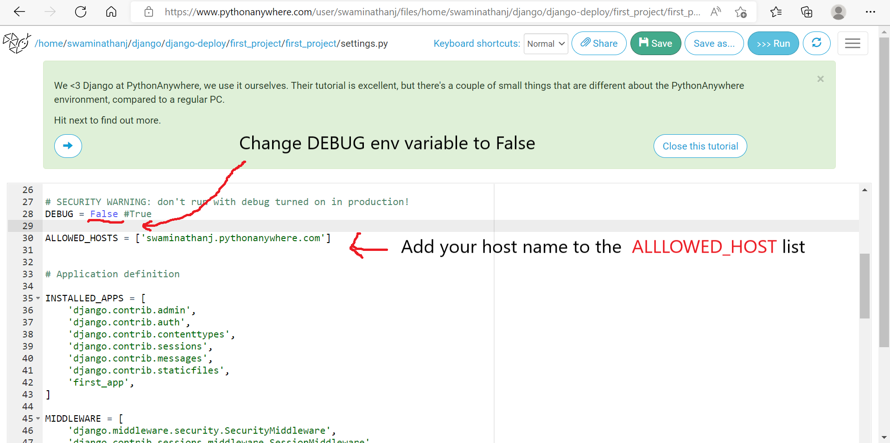
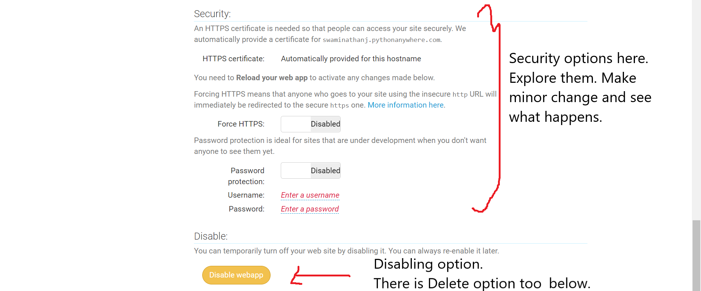

# Django Deployment

The instructions to deploy in www.pythonanywhere.com is provided below.

## Pre-deployment Steps 
* Move your code to GitHub repository
  * Create a repository in Github
  * Note the name and the path to &lt;your-project&gt;.git
  * Drag and drop you project folder into the repository
  * Commit

## Clone your code from GitHub to pythonanywhere
* Login to pythonanywhere
* Execute the GitHub command to clone 
```
git clone https://github.com/<myusername>/<your-project>.git
```  
## Deployment Steps

### 0. Getting started with deployment process 
The important pages: Web, Files, Consoles. The link to deployment page. The Reload button to refresh the changed settings.




### 1. Setting the path to virtual environment
Navigate in the bash prompt to confirm the exact location.



Here is how you can navigate to the virtual environment.


Note that, this is a linux box and you need a different command to create the virtual environment.
> mkvirtualenv --python=/usr/bin/python3.8 mysite-virtualenv

### 2. Creating a new Web app using manual configuration
Don't use Django. Use manual configuration.



### 3. Setting the path to project source code
Navigate in the bash prompt to confirm the exact location.



### 4. Modifying the wsgi.py with project path and add to environment settings
This is the most important file from the deployment standpoint.



### 5. Setup the static folder path
There are 2 static folder paths to setup. The first one is static admin inside virtual environment folder. The second one is the static folder in the project. Make sure the paths are correct and spelt right. 



### 6. Changes to settings.py
Make the following changes to settings.py. (i) Set DEBUG to False as your app is in production stage now and being launched. (ii) Include your host name in the ALLOWED_HOSTS list (within single quotes). So far, it has been localhost and hence no host needed to be added.

- Navigate to inner level project folder (first_project/first_project in this case)


- Open settings.py and make the aforementioned changes


### 7. Explore other options mentioned in the Web app page

Security options, disabling and deleting the Web app.


